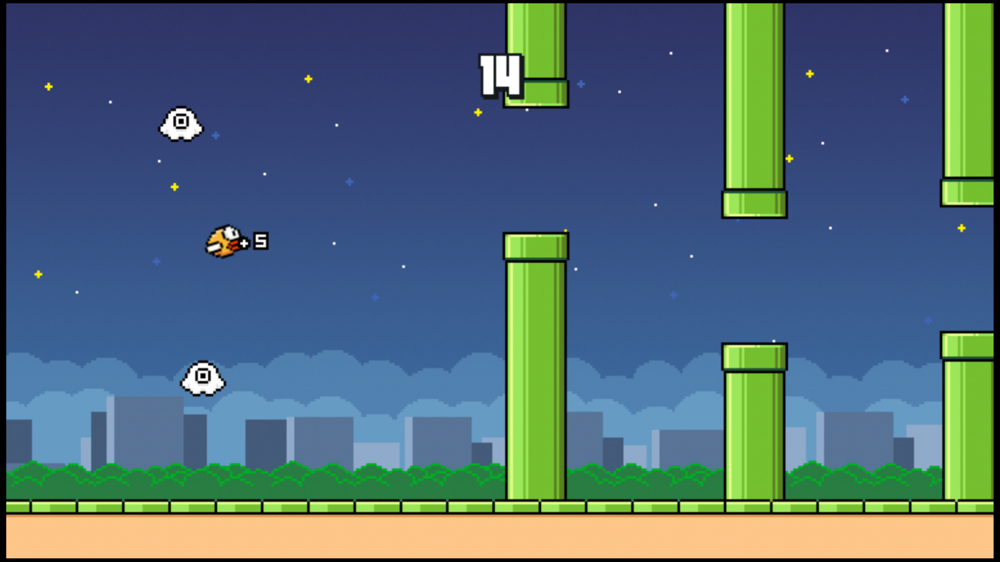
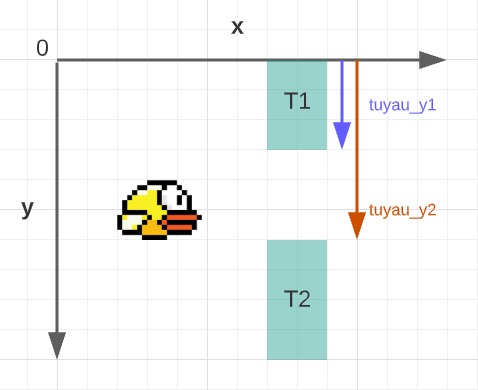

# Le Flappy Bird

Le but de cette exercice est de coder une version très simplifié du jeu Flappy bird sur un `micro:bit`.



## Principe du jeu

Dans Flappy, l'oiseau doit esquiver des tuyaux verticaux le plus longtemps possible. Dans la version originale, les mouvements de l'oiseau sont soumis à la gravité. Ici nous simplifierons ce déplacement.

### L'oiseau

L'oiseau est représenté de base par un oiseau, il peut se déplacer verticalement, vers le haut ou vers le bas.

### Les tuyaux

Ils constituent les obstacles principaux du jeu. Ils se déplacent horizontalement. Ils apparaissent au fur et à mesure.

### Fin de la partie

La partie s'arrête lorsque l'oiseau percute un tuyau. Le score correspond au nombre de tuyaux qui auront été évités tout le long de la partie. 

Pour coder notre jeu Flappy bird, nous allons utiliser une carte `micro:bit`. Sur la carte, nous nous intéresserons aux 2 boutons (A et B) ainsi qu'à l'écran. Ce dernier est composé de 25 pixels rouges répartis sur 5 lignes et 5 colonnes. Les sections suivantes expliquent comment les utiliser.


## Fonctionnement de la carte `micro:bit`

### L'écran

Chaque pixel de l'écran est une LED rouge, que l'on peut allumer ou éteindre à un certain degré d'intensité allant de 0 à 9 (0 -> éteinte, 9 -> allumée au max). La ligne de code ci-dessous allumera le pixel de la première ligne et troisième colonne au niveau 6.

```py
# Attention, la numérotation des lignes et des colonnes commence à 0
display.set_pixel(0, 2, 6)
```

Il pourra vous être utile de réinitialiser l'écran et d'éteindre toutes les LEDs d'un coup. Pour cela, on utilise la fonction suivante.

```py
# Cette commande a le même effet que faire display.set_pixel(i, j, 0) 25 fois !
display.clear()
```

### Les boutons

Afin de pouvoir diriger notre oiseau, nous allons utiliser les boutons A et B sur les côtés de l'écran.Quand on tient la carte `micro:bit` dans le bon sens, le bouton A est à gauche et le bouton B est à droite. On souhaite que l'appui sur le bouton A fasse monter l'oiseau d'un monter d'un pixel, et le B le fait descendre.

Reste à savoir comment savoir dans notre code qu'un bouton a été appuyé. Il existe pour cela 3 fonctions principales.

```py
button_a.is_pressed()   # Ces fonctions renvoient True ou False si les boutons sont
button_b.is_pressed()   # appuyés quand la ligne est exécutée par le micro:bit

button_a.was_pressed()  # Ces fonctions renvoient True ou False si les boutons ont
button_b.was_pressed()  # été appuyés depuis la dernière fois qu'elles ont été appelées

button_a.get_presses()  # Ces fonctions renvoient le nombres d'appuis effectués sur
button_b.get_presses()  # le bouton depuis la dernière fois qu'elles ont été appelées
```

Pour ce projet, nous utiliserons principalement `get_presses()` pour déplacer notre oiseau à l'emplacement voulu.


## Le jeu

### L'oiseau

Ici, l'oiseau est représenté par un pixel. Ses coordonnées d'orgine sont données par les variables: `oiseau_x` et `oiseau_y`.

Pour simplifier l'exercice, plusieurs variables sont fournies dans le code. Elles représentent les informations importantes sur l'oiseau et la partie en cours.




### Les tuyaux

Pour les représenter, nous avons fait le choix d'utiliser 2 coordonnées en y, `tuyau_y1` et `tuyau_y2` et une en x, `tuyau_x`. 

`tuyau_y1` correspond à la hauteur de la fin du tuyau du haut. Ce tuyau va donc de 0 à `tuyau_y1`. La deuxième correspond à la hauteur du début du tuyau du bas. Ce tuyau va donc de `tuyau_y2` à 4.

Ces coordonnées seront générées aléatoirement grâce au module (ensemble de fonction) `random`.

```python
>>> random.randint(0, 3)
0
>>> random.randint(0, 3)
3
>>> random.randint(0, 8)
4
```

À chaque tour ils avancent d'un cran vers la gauche, donc leurs coordonnée `x` décroit de 1.

Dès que les tuyaux sont arrivé en 0, ils sont détruits (il faut alors les désafficher) et de nouveaux sont créés.
