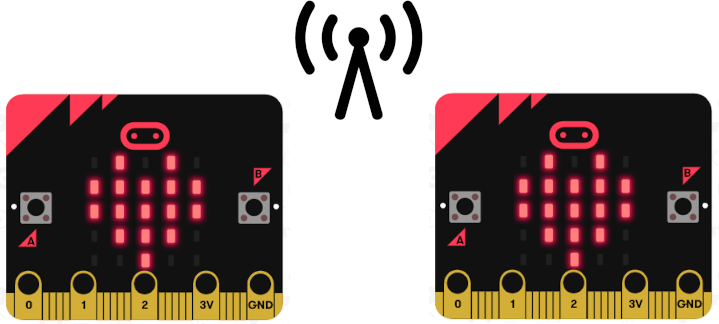

# Télémoticônes

Le but de cette exercice est de coder une messagerie d'émoticônes sur `micro:bit`.



## Objectif

L'objectif de cet atelier est de pouvoir échanger des émoticônes entre `micro:bit`. Le `micro:bit` aura 2 modes de fonctionnement : envoi et réception. L'utilisateur peut changer de mode en retournant la carte face contre terre.

### Envoi

L'utilisateur peut choisir un émoticône qui s'affiche sur son écran à l'aide des boutons A et B (ou gauche et droite), et n'aura plus qu'à secouer l'appareil pour l'envoyer.

### Réception

En mode réception, le `micro:bit` se contente d'écouter tous les messages qu'il reçoit sur son canal de communication et affiche l'émoticône correspondant.

## Fonctionnement de la carte `micro:bit`

### L'écran

On affiche un émoticône à l'écran en utilisant la fonction
`display.show` par exemple :
```py
display.show(Image.HEART)
```

On peut éteindre l'écran en utilisant la fonction
`display.clear` comme cela :
```py
display.clear()
```

Voici une liste des images (émoticônes ou non) que vous pouvez afficher à l'écran :

* `Image.HEART`
* `Image.HEART_SMALL`
* `Image.HAPPY`
* `Image.SMILE`
* `Image.SAD`
* `Image.CONFUSED`
* `Image.ANGRY`
* `Image.ASLEEP`
* `Image.SURPRISED`
* `Image.SILLY`
* `Image.FABULOUS`
* `Image.MEH`
* `Image.YES`
* `Image.NO`
* `Image.CLOCK12`, `Image.CLOCK11`, `Image.CLOCK10`, `Image.CLOCK9`,
    `Image.CLOCK8`, `Image.CLOCK7`, `Image.CLOCK6`, `Image.CLOCK5`,
    `Image.CLOCK4`, `Image.CLOCK3`, `Image.CLOCK2`, `Image.CLOCK1`
* `Image.ARROW_N`, `Image.ARROW_NE`, `Image.ARROW_E`,
    `Image.ARROW_SE`, `Image.ARROW_S`, `Image.ARROW_SW`,
    `Image.ARROW_W`, `Image.ARROW_NW`
* `Image.TRIANGLE`
* `Image.TRIANGLE_LEFT`
* `Image.CHESSBOARD`
* `Image.DIAMOND`
* `Image.DIAMOND_SMALL`
* `Image.SQUARE`
* `Image.SQUARE_SMALL`
* `Image.RABBIT`
* `Image.COW`
* `Image.MUSIC_CROTCHET`
* `Image.MUSIC_QUAVER`
* `Image.MUSIC_QUAVERS`
* `Image.PITCHFORK`
* `Image.XMAS`
* `Image.PACMAN`
* `Image.TARGET`
* `Image.TSHIRT`
* `Image.ROLLERSKATE`
* `Image.DUCK`
* `Image.HOUSE`
* `Image.TORTOISE`
* `Image.BUTTERFLY`
* `Image.STICKFIGURE`
* `Image.GHOST`
* `Image.SWORD`
* `Image.GIRAFFE`
* `Image.SKULL`
* `Image.UMBRELLA`
* `Image.SNAKE`

### Les boutons

Afin de pouvoir choisir notre émoticône, nous allons utiliser les boutons A et B sur les côtés de l'écran. Quand on tient la carte `micro:bit` dans le bon sens, le bouton A est à gauche et le bouton B est à droite.

Pour ce projet, nous utiliserons `was_pressed()` pour déterminer si le bouton a été pressé depuis la dernière fois que la fonction a été appelée.

```py
button_a.was_pressed()  # Ces fonctions renvoient True ou False si les boutons ont
button_b.was_pressed()  # été appuyés depuis la dernière fois qu'elles ont été appelées
```

### Les mouvements

Pour détecter les mouvements du micro:bit, on utilise la fonction `accelerometer.was_gesture()` en précisant le mouvement désiré, par exemple :

```py
accelerometer.was_gesture('shake')  # Détecte si le micro:bit a été secoué.
accelerometer.was_gesture('face_down') # Détecte si le micro:bit a été retourné
```

Pour envoyer notre émoticône, nous testerons donc si le micro:bit a été secoué, et pour changer de mode, nous vérifierons s'il a été retourné.

### La radio

Nos micro:bit communiquent sans fil via radio. Nous allons utiliser 2 fonctions : `radio.send` et `radio.receive` pour envoyer et recevoir.

`radio.receive()` permet d'écouter la radio et récupérer le message.
`radio.send()` permet d'envoyer un message texte sur le canal radio.

## Le programme

Le programme est constitué essentiellement d'une boucle infinie au cours de laquelle le micro:bit adoptera le comportement correspondant à son mode actif et deux fonctions principales :
- **receive** : écoute les messages à la radio et affiche un message si reçu.
- **send** : permet à l'utilisateur de naviguer dans la liste des émoticônes et d'envoyer celui sélectionné si le micro:bit est secoué.

Il faudra vérifier en continu si le micro:bit a été retourné pour savoir s'il est nécessaire de changer de mode.

Ensuite, suivant le mode il faudra appeler la fonction correspondante.

### Les emojis
